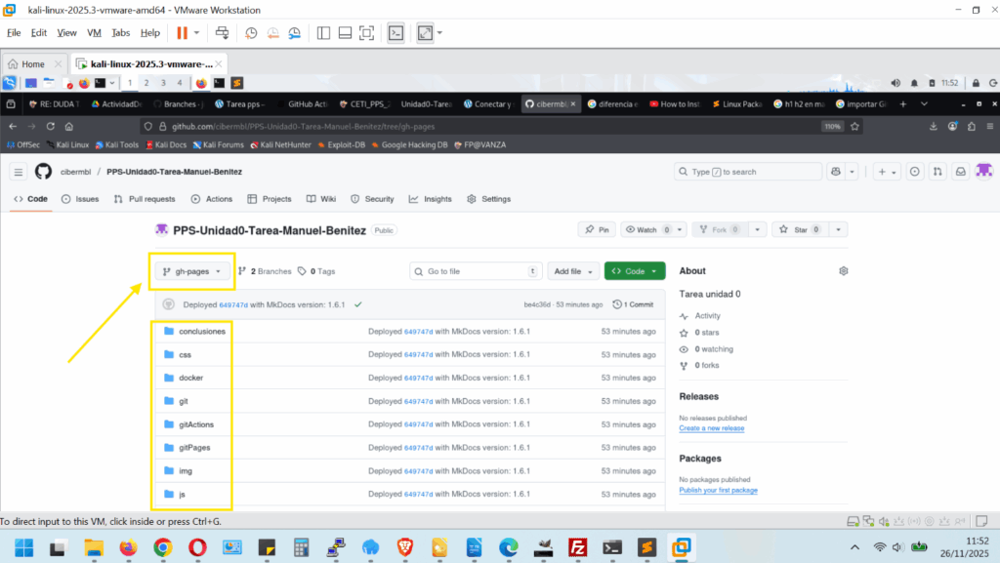
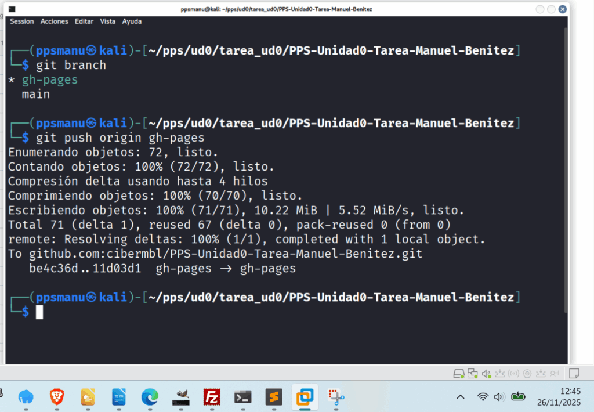
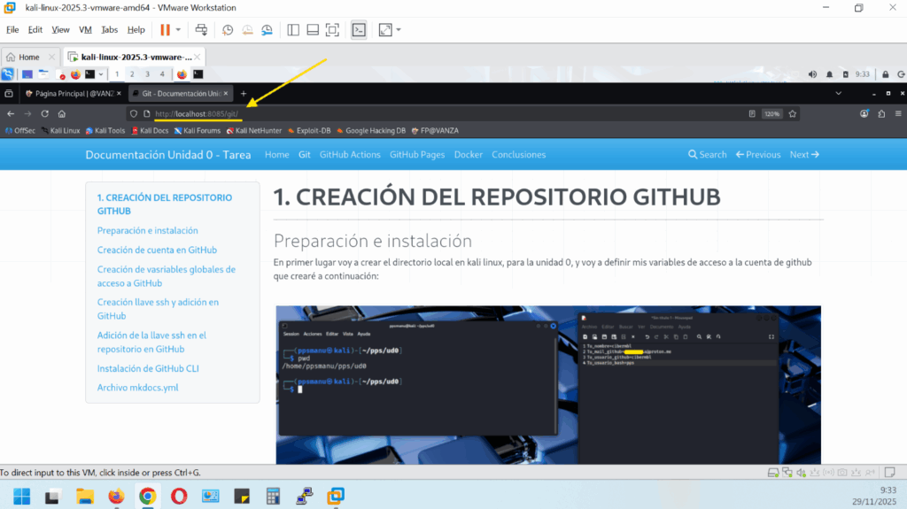
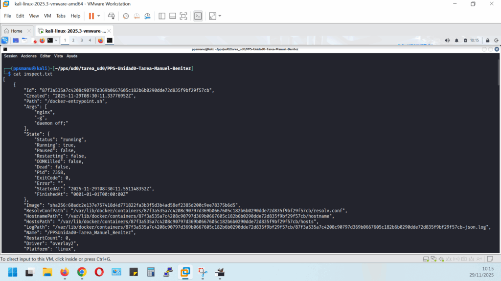

# **4. CREACIÓN DE UN CONTENEDOR DE SERVICIOS NGINX CON DOCKER**

---


## Introducción

La idea es crear un contenedor servicios web con NGINX que para que sirva para publicar documentación que se ha generado previamente en github.io con gitActions y gitPages. Esto nos servirá para poner en practica los conocimientos en Docker.

Si echamos un vistazo a la rama gh-pages de nuestro repositorio -> [https://github.com/cibermbl/PPS-Unidad0-Tarea-Manuel-Benitez.git](https://github.com/cibermbl/PPS-Unidad0-Tarea-Manuel-Benitez.git) podemos observar como vemos la estructura archivos de la web estática que sirve para la documentación en GitHub pages:



Mediante Bind Mount en docker podemos persistir los datos de la rama gh-pages de Github, de una manera solvente. Veamos:

En primer lugar vamos a pasar a la rama gh-pages mediante:

```
git checkout gh-pages
```


Que no cunda el pánico, el error que vemos, es debido a que por defecto, Github clona la rama main, y por lo tanto no tenemos en local la rama gh-pages, por lo tanto procedemos a clonarla,

```
git fetch
git checkout gh-pages
```


Observamos que no tenemos permiso para las rutas de las imágenes, y es por que al cambiar a ramas gh-pages, el directorio /doc/img con las imágenes no existe, aún así al final nos indica de que si ha cambiado de rama satisfactoriamente:


Para arreglar estos permisos, hacemos:

```
sudo chown -R $USER:$USER docs/
<div></div>
# Vuelvo a cambiar de rama para comprobar que no hay errores
<div></div>
git checkout main
```


Aún me indica que aún hay archivos modificados o pendientes y Git aún no permite cambiar de rama, para no perderlos, para arreglar esto hacemos:


```
# Para ver que archivos están aún pendientes

git status
```


Esto significa que tu carpeta docs/ existe pero no forma parte de la rama gh-pages.

Para arreglar esto, sin perder el directorio docs/ en main, tenemos que añadir el directorio docs/ y hacer un commit:

```
git add docs/
git commit -m "Añadiendo directorio docs"
```

Volvemos a la rama gh-pages,

```
git checkout gh-pages
```


y comprobamos que ya está en la rama correcta:

```
* gh-pages
  main
```

y hacemos un push de la rama:

```
git push origin gh-pages
```




Una vez que se ha subido correctmante la rama gh-pages, comprobamos lo siguiente:

En el repositorio de Github -> Settings/pages chequeamos en Build and deployment, en el desplegable Source seleccionamos Deploy from a branch y seleccionamos la rama gh-pages y en Folder debe de estar habilitado (porque ya lo habilité en apartados anteriores), el directorio / (root):


A continuación compruebo que el directorio contiene la web estática con contenido, HTML, CSS, JS, imágenes, etc:

```
ls -l
```


A continuacíon creo el contenedor NGINX con bind mount:

```
docker run --name PPSUnidad0-Tarea_Manuel_Benitez \
 -p 8085:80 \
 -v $(pwd):/usr/share/nginx/html \
 -d nginx
```

nombre del contenedor: PPSUnidad0-Tarea\_Manuel\_Benitez

puerto: 8085

Bind mount monta el directorio de la web

Y a continuación compruebo que el contenedor está corriendo:

```
docker ps
```


## **1\. CAPTURA Creación de la máquina (contenedor)**


A continuación vamos a comprobar que dicha web estática ya está cargando a través del puerto 8085 en local.

En el navegador de la máquina kali, cargo la siguiente url -> **http://localhost:8085**

## 2\. CAPTURA Contenedor NGINX en marcha y mostrando la web de GitHub pages en localhost.



A continuo procedo a la creación del archivo docker inspect, que nos mostrará información detallada del contenedor creado.

```
docker inspect PPSUnidad0-Tarea_Manuel_Benitez > inspect.txt
```

## 3\. **CAPTURAS del archivo -> inspect.txt**




Adjunto archivo inspect.txt, en el archivo comprimido de la entrega de la tarea.
