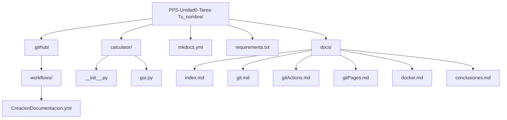
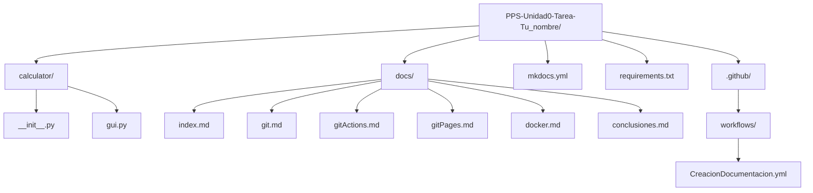

## 1. Creación del repositorio

En primer lugar voy a crear el directorio local en kali linux, para la unidad 0, y voy a definir mis variables de acceso a la cuenta de github que crearé a continuación:

&lt;img&gt;Screenshot showing two terminal windows and a mousepad window. The left terminal shows:
```
(ppsmanu@kali) - [~/pps/ud0]
$ pwd
/home/ppsmanu/pps/ud0
```

The right terminal shows:
```
(ppsmanu@kali) - [~/pps/ud0]
```

The mousepad window titled "Sin título 1 - Mousepad" contains the following text:
1 Tu_nombre=cibermbl
2 Tu_mail_github=proton.me
3 Tu_usuario_github=cibermbl
4 Tu_usuario_bash=pps
&lt;/img&gt;

Copio y pego mis variables en el terminal:

---


ppsmanu@kali: ~/pps/ud0

Session Acciones Editar Vista Ayuda

```
(ppsmanu@kali)-[~/pps/ud0]
$ pwd
/home/ppsmanu/pps/ud0
```

```
(ppsmanu@kali)-[~/pps/ud0]
$ Tu_nombre=cibermb
Tu_mail_github=XXXXXXXX@proton.me
Tu_usuario_github=cibermb
Tu_usuario_bash=pps
```

Creo otro directorio, llamado *tarea_ud0*, dentro

```
(ppsmanu@kali)-[~/pps/ud0]
$ mkdir tarea_ud0
```

```
(ppsmanu@kali)-[~/pps/ud0]
$ cd tarea_ud0/
```

```
(ppsmanu@kali)-[~/pps/ud0/tarea_ud0]
$ pwd
/home/ppsmanu/pps/ud0/tarea_ud0
```

```
(ppsmanu@kali)-[~/pps/ud0/tarea_ud0]
$ 
```

Consulto actualizaciones con -> `apt update` y las ejetucto con `apt upgrade`:

---


ppsmanu@kali: ~/pps/ud0

Session Acciones Editar Vista Ayuda

```
(ppsmanu@kali)-[~/pps/ud0]
$ Tu_nombre=ppsmb1
Tu_mail_github=[REDACTED]@proton.me
Tu_usuario_github=ppsmb1
Tu_usuario_bash=pps
```

(ppsmanu@kali)-[~/pps/ud0]
$ sudo apt update
[sudo] contraseña para ppsmanu:
Obj:1 http://http.kali.org/kali kali-rolling InRelease
Se pueden actualizar 2 paquetes. Ejecute «apt list --upgradable» para verlos.

(ppsmanu@kali)-[~/pps/ud0]
$ sudo apt upgrade

A continuación instalo git:

sudo apt install git

---


&lt;img&gt;Screenshot of a terminal window showing the command "sudo apt install git". The terminal prompt is "(ppsmanu@kali)~ /pps/ud0" and the command line shows "$ sudo apt install git". The system tray icons are visible at the bottom.&lt;/img&gt;

Procedo a crearle la cuenta en github, en este enlace ->

https://github.com/signup?source=login

&lt;img&gt;Screenshot of GitHub's sign-in page. It displays the GitHub logo and the text "Sign in to GitHub". There are fields for "Username or email address" and "Password", with a "Forgot password?" link next to the password field. Below that, there are two buttons: "Continue with Google" and "Continue with Apple". At the bottom left, it says "New to GitHub? Create an account" with a yellow arrow pointing to it. The time 12:33 and date 16/11/2025 are visible in the system tray at the bottom.&lt;/img&gt;

relleno los datos correspondientes,

---


&lt;img&gt;Screenshot of a web browser window showing the GitHub sign-up page. The URL bar at the top shows "github.com/signup?source=login". Below the URL bar, there are several Kali-related bookmarks: "Kali Docs", "Kali Forums", "kali NetHunter", "Exploit-DB", and "Google Hacking DB". On the left side of the main content area, there's a section titled "Create your free account" with subtext "Explore GitHub's core features for individuals and organizations." and a "See what's included" link. Below this, there are three animated characters: a purple fish-like creature, a blue robot-like figure, and a yellow duck-like creature, all set against a starry background.

On the right side of the main content area, there's a section titled "Sign up for GitHub" with fields to enter email, password, username, and country/region. There's also a checkbox for email preferences and a "Create account" button. At the very bottom of this section, there's a note stating "By creating an account, you agree to the Terms of Service. For more information".

The status bar at the bottom of the browser window shows various application icons (e.g., Chrome, Firefox, Notepad++, FileZilla, TeamViewer, ProtonVPN, Docker, Git Bash, etc.), network indicators, battery life, time "12:43", and date "16/11/2025".&lt;/img&gt;

Recibiré un código al email, aportado, y ya rellenándolo tendré la cuenta creada.

Hago login en github,

&lt;img&gt;Screenshot of a web browser window showing the GitHub sign-in page. The URL bar at the top shows "github.com/login". The main content area has a header "Sign in to GitHub". Below that, there's a green notification box saying "Your account was created successfully! Please sign in to continue.".

Below the notification, there's a form field labeled "Username or email address" with the placeholder "@proton.me". Next to it, there's a "Forgot password?" link.

Underneath the username field, there's a password field with obscured characters. To the right of the password field, there's a "Sign in" button.

Below the password field, there's a "or" link, followed by two buttons: "Continue with Google" and "Continue with Apple".

At the bottom of the page, there's a "New to GitHub? Create an account" link and a "Sign in with a passkey" link.&lt;/img&gt;

---


A continuación voy a fijar las variables globales de acceso a github, en nuestro terminal de kali linux, para mayor comodidad, y asi las toma tal y como las definí al principio de esta tarea (la puedes ver el .txt de la izquierda que cree):

```
git config --global user.name $Tu_usuario_github
git config --global user.email $Tu_mail_github
git config --global init.defaultBranch main
git config --global core.editor nano
```

&lt;img&gt;Screenshot showing two windows side-by-side. The left window is a text editor titled "Escritorio/variables_github.txt - Mousepad". It contains four lines:
1. tu_nombre=____________
2. Tu_mail_github=____________@proton.me
3. Tu_usuario_github=____________
4. Tu_usuario_bash=pps

The right window is a terminal with the following commands entered:
```
git config --global user.name $Tu_usuario_github
git config --global user.email $Tu_mail_github
git config --global init.defaultBranch main
git config --global core.editor nano
```
The terminal shows the output of the first command, which is "cibermbl".&lt;/img&gt;

Para comprobar que toma bien las variables, hago la comprobación con el nombre de usuario de github, mediante el comando -> `git config user.name`

Y efectivamente, me lo devuelve correctamente en el terminal.

&lt;img&gt;Screenshot of a terminal window. The prompt shows `(ppsmanu@kali)~/pps/ud0/tarea_ud0`. The command entered is:
```
git config user.name
```
The output of this command is displayed below the prompt, showing "cibermbl".&lt;/img&gt;

---


A continuación configuramos `git config -global core.pager <<` -> con eso conseguimos que ante comandos como `git diff` o `git log`, los resultados se muestren por completo y sin paginar en el terminal.

```
(ppsmanu@kali)-[~/pps/ud0/tarea_ud0]
$ git config --global core.pager ""
```

A continuación voy a crear la llave ssh para nuestro equipo para añadirla en github, y así darle un plus de seguridad en las conexiones:

```
ssh-keygen -t ed25519 -C $Tu_mail_github
```

```
(ppsmanu@kali)-[~/pps/ud0/tarea_ud0]
$ ssh-keygen -t ed25519 -C $Tu_mail_github
Generating public/private ed25519 key pair.
Enter file in which to save the key (/home/ppsmanu/.ssh/id_ed25519):
:
Enter passphrase for "/home/ppsmanu/.ssh/id_ed25519" (empty for no passphrase):
Enter same passphrase again:
Your identification has been saved in /home/ppsmanu/.ssh/id_ed25519
Your public key has been saved in /home/ppsmanu/.ssh/id_ed25519.pub
The key fingerprint is:
Erwfbew4MsI @proton
.me
The key's randomart image is:
+--[ED25519 256]--+
    o.+
   . + .oBB
* *.*BO
. X B=o*
S B *o.o
* *.*o
E o = .
. o .
+--[SHA256]--+

(ppsmanu@kali)-[~/pps/ud0/tarea_ud0]
$

---


bash
(ppsmanu@kali)-[~/pps/ud0/tarea_ud0]
$ eval "$(ssh-agent -s)"
Agent pid 305054

(ppsmanu@kali)-[~/pps/ud0/tarea_ud0]
$ ssh-add ~/.ssh/id_ed25519
Identity added: /home/ppsmanu/.ssh/id_ed25519 (aiproton.me)

(ppsmanu@kali)-[~/pps/ud0/tarea_ud0]
$ ✘
```

A continuación, procedo a copiar la clave ssh pública que he creado en github, y la borro en mi equipo,

```bash
(ppsmanu@kali)-[~/.ssh]
$ cat id_ed25519.pub
ssh-ed25519 AAAA...ppmg3DDEQ1Vw yyyW+ aiproton.me

(ppsmanu@kali)-[~/.ssh]
$ ✘
```

y para copiarla en github, entro con la cuenta de github, y en mi perfil -> settings

---


y en SSH and GPG keys

&lt;img&gt;Screenshot of GitHub sidebar with "Settings" highlighted by a red arrow.&lt;/img&gt;

Añado la clave a través del botón verde New SSS key,

&lt;img&gt;Screenshot of GitHub settings page showing "SSH and GPG keys" section with "New SSH key" button highlighted by a yellow arrow.&lt;/img&gt;

&lt;img&gt;Screenshot of GitHub settings page showing "SSH keys" and "GPG keys" sections, with "New SSH key" and "New GPG key" buttons highlighted by yellow arrows.&lt;/img&gt;

---


le escribo un título, y añado:

Add new SSH Key

Title
ssh_pps

Key type
Authentication Key

Key
[REDACTED]

Add SSH key

SSH keys

This is a list of SSH keys associated with your account. Remove any keys that you do not recognize.

Authentication keys

&lt;img&gt;SSH icon&lt;/img&gt; ssh_pps
SSH Added on Nov 16, 2025
Never used — Read/write

Delete

Check out our guide to connecting to GitHub using SSH keys or troubleshoot common SSH problems.

A continuación procedo a crear un repositorio en github,

haciendo clic en el avatar del perfil (arriba a la derecha con la flecha amarilla) y *Repositories*,

---


&lt;img&gt;Page with GitHub menu options.&lt;/img&gt;

New,

&lt;img&gt;Page showing new repository creation button on GitHub.&lt;/img&gt;

Le doy nombre al repositorio, una descripción, y la opción de *Add README* activada.

---


# Create a new repository

Repositories contain a project's files and version history. Have a project elsewhere? [Import a repository](Import%20a%20repository).

Required fields are marked with an asterisk (*).


1 General

**Owner** * cibermbl
**Repository name** * PPS-Unidad0-Tarea-Manuel-Benitez
☑ PPS-Unidad0-Tarea-Manuel-Benitez is available.

Great repository names are short and memorable. How about potential-couscous?

**Description**
Tarea unidad 0
14 / 350 characters

2 Configuration

**Choose visibility** *
Choose who can see and commit to this repository Public

**Add README**
READMEs can be used as longer descriptions. [About READMEs](About%20READMEs)

**Add .gitignore**
.gitignore tells git which files not to track. [About ignoring files](About%20ignoring%20files)

**Add license**
Licenses explain how others can use your code. [About licenses](About%20licenses)

[Create repository](Create%20repository)


y a continuación copio el código de acceso en ssh,

---


&lt;img&gt;Screenshot of GitHub repository page for "PPS-Unidad0-Tarea-Manuel-Benitez". The page shows a list of files (README.md, README), with a sidebar on the right displaying repository details like "Tarea unidad 0", "Readme", "Activity", "0 stars", "0 watching", "0 forks", "Releases" (no releases published), and "Packages" (no packages published). A yellow arrow points to the "Code" dropdown button at the top right, another arrow points to the "Clone" button under the "Local" tab, a third arrow points to the SSH link, and a fourth arrow points to the download icon.&lt;/img&gt;

y hago un *git clone* con ese código ssh del repositorio, tal que asi:

```bash
git clone git@github.com:cibermbl/PPS-Unidad0-Tarea-Manuel-Benitez.git
```

Observamos, que nos da una primera advertencia sobre la conexión al repositorio por ssh, y a la pregunta de si estoy seguro de que quiero conectarme escribo Yes,

---


&lt;img&gt;Screenshot of a terminal window showing Git commands being executed.&lt;/img&gt;

y observamos como ha creado el nuevo directorio -> PPS-Unidad0-Tarea-Manuel-Benitez,

navego dentro de él, y listo lo que contiene con -> ls -la

Observamos, como contiene el *README.md*, el directorio *.git*, etc.

---


bash
(ppsmanu@kali)-[~/pps/ud0/tarea_ud0]
$ ls
PPS-Unidad0-Tarea-Manuel-Benitez

(ppsmanu@kali)-[~/pps/ud0/tarea_ud0]
$ cd PPS-Unidad0-Tarea-Manuel-Benitez/

(ppsmanu@kali)-[~/pps/ud0/tarea_ud0/PPS-Unidad0-Tarea-Manuel-Benitez]
$ ls -la
total 16
drwxrwxr-x 3 ppsmanu ppsmanu 4096 nov 16 21:06 .
drwxrwxr-x 3 ppsmanu ppsmanu 4096 nov 16 21:06 ..
drwxrwxr-x 7 ppsmanu ppsmanu 4096 nov 16 21:06 .git
-rw-r--r-- 1 ppsmanu ppsmanu 50 nov 16 21:06 README.md

(ppsmanu@kali)-[~/pps/ud0/tarea_ud0/PPS-Unidad0-Tarea-Manuel-Benitez]
```

A continuación, procedo a crear la estructura del repositorio. Que debe ser como éste:



Para ello, en primer lugar procedo a instalar la herramienta GitHub CLI, la cual nos permite interactuar directamente desde la linea de comandos con GitHub, y nos permite crear, modificar, repositorios directamente desde la terminal.

Nota.- En primer lugar, me cercioro de que ya tengo las variables inicializadas, tal y como lo hice en renglones anteriores, mediante el

---


código:

git config user.name

&lt;img&gt;Screenshot of a terminal window showing the command "git config user.name cibermbl" being executed.&lt;/img&gt;

Y efectivamente, tengo las variables declaradas, correctamente.

Instalación de GitHub CLI:

sudo apt update
sudo apt install gh

---


&lt;img&gt;Terminal window showing git configuration and sudo apt update command.&lt;/img&gt;

Una vez instalado, procedo a autenticarme en github.com:

---


gh auth login

Nos das dos opciones de autenticación, y escojo GitHub.com (con el cursos y enter),

&lt;img&gt;Screenshot of a terminal window showing package installation details and a prompt for GitHub authentication.&lt;/img&gt;

A continuación nos da dos opciones de protocolo de conexión, y dado que ya tengo configurado por ssh, para seguir la política de buenas prácticas en ciberseguridad, la escojo,

---


&lt;img&gt;Screenshot of a terminal window showing package installation details.&lt;/img&gt;

Observamos, como reconoce la clave pública, que anteriormente añadí en github, y le damos a enter,

&lt;img&gt;Screenshot of a terminal window showing GitHub authentication prompt with SSH selected.&lt;/img&gt;

A continuación procedo a logearme mediante la opción -> Login with a web browser,

Nos genera una clave de un solo uso, la cual deberemos de copiar en github.com,

---


&lt;img&gt;Screenshot of a terminal window showing the command `gh auth login`. The terminal prompt is `(ppsmanu@kali)~` and the command entered is `$ gh auth login`. The output includes questions like "What account do you want to log into?", "What is your preferred protocol for Git operations on this host?", "Upload your SSH public key to your GitHub account?", and "How would you like to authenticate GitHub CLI?". A yellow arrow points to the line "First copy your one-time code: 929D-175C". Below that, it says "Press Enter to open github.com in your browser ...". The system tray shows the time as 8:00 and the date as 18/11/2025.&lt;/img&gt;

Presiono Enter, y se abre el navegador, y procedemos a entrar con el usuario y contraseña de github, elegimos signed in as (con nuestro usuario de github), y clic en tecla Continue,

&lt;img&gt;Screenshot of a web browser window displaying the GitHub "Device Activation" page. The page shows a GitHub logo at the top, followed by "Device Activation". Below that, it says "Signed in as cibermbl" with a "Continue" button next to it. There's also a link "Use a different account". The address bar shows "github.com/login/device/select_account". The system tray shows the time as 8:23 and the date as 18/11/2025.&lt;/img&gt;

Y ya podemos pegar el código anterior:

---


&lt;img&gt;Device Activation&lt;/img&gt;
&lt;img&gt;github.com/login/device?skip_account_picker=true&lt;/img&gt;

&lt;img&gt;OffSec&lt;/img&gt; &lt;img&gt;Kali Linux&lt;/img&gt; &lt;img&gt;Kali Tools&lt;/img&gt; &lt;img&gt;Kali Docs&lt;/img&gt; &lt;img&gt;Kali Forums&lt;/img&gt; &lt;img&gt;Kali NetHunter&lt;/img&gt; &lt;img&gt;Exploit-DB&lt;/img&gt; &lt;img&gt;Google Hacking DB&lt;/img&gt;

&lt;img&gt;Github logo&lt;/img&gt;

**Authorize your device**

&lt;img&gt;User icon&lt;/img&gt; Signed in as **cibermbl**

Enter the code displayed in the app or on the device you're signing in to.
Never use a code sent by someone else.

<table>
  <tr>
    <td>9</td>
    <td>2</td>
    <td>9</td>
    <td>D</td>
    <td>1</td>
    <td>7</td>
    <td>5</td>
    <td>C</td>
  </tr>
</table>

<button>Continue</button>

GitHub staff will never give you a code to enter on this page.

&lt;img&gt;Github logo&lt;/img&gt; © 2025 GitHub, Inc. Terms Privacy Security Status Community Docs Contact Manage cookies Do not share my personal information

Clic en **Authorize github**,

---


&lt;img&gt;Github logo with a green checkmark between two cat silhouettes&lt;/img&gt;

# Authorize GitHub CLI

⚠️ This authorization was requested from **San Luis de Sabinillas**
88.98.107.183 on November 18th, 2025 at 08:27 (CET)
Make sure you trust this device as it will get access to your account.

---

&lt;img&gt;Purple elephant icon&lt;/img&gt; **GitHub CLI by GitHub** wants to access your cibermbi account

&lt;img&gt;Key icon&lt;/img&gt; **Public SSH keys**
Admin access

&lt;img&gt;Document icon&lt;/img&gt; **Gists**
Read and write access

&lt;img&gt;Building icon&lt;/img&gt; **Organizations and teams**
Read-only access

&lt;img&gt;Repository icon&lt;/img&gt; **Repositories**
Public and private

---

Cancel Authorize github

Requested from San Luis de Sabinillas 88.98.107.183 on November 18th, 2025 at 08:27 (CET)


y ya comprobamos como ya está sincronizado con mi ordenador,

---


&lt;page_number&gt;1&lt;/page_number&gt;

A continuación, paso a crear la estructura del repositorio:



Comandos:

---


#Para crear los directorios

mkdir calculator docs

#Para crear los archivos

touch directorio/archivo

#En el ejemplo:

touch calculator/__init__.py calculator/gui.py docs/index.md mkdocs.yml requirements.txt
touch docs/git.md docs/gitActions.md docs/gitPages.md docs/docker.md docs/conclusiones.md

Compruebo como está el estado del proyecto en Github:

---


git status

y se puede comprobar como los archivos están los archivos sin seguimiento,

&lt;img&gt;Screenshot of a terminal window showing the output of 'git status'. The output includes:
- Current branch: En la rama main
- Remote tracking: Tu rama está actualizada con 'origin/main'.
- Untracked files:
  - Archivos sin seguimiento:
    (usa "git add <archivo>..." para incluirlo a lo que será confirmado)
    - ./calculator/
    - ./mkdocs.yml
    - ./requirements.txt
- A message indicating that nothing has been added to the commit but untracked files are present, suggesting use of "git add" to track them.
The terminal prompt shows: (ppsmanu@kali)~/pps/ud0/tarea_ud0/PPS-Unidad0-Tarea-Manuel-Benitez/docs&lt;/img&gt;

no hay nada agregado al commit pero hay archivos sin seguimiento presentes (usa "git add" para hacerles seguimiento)

Añado todos los directorios y archivos al directorio github,

git add .

Compruebo el estado, y observamos como aparecen en el area *staged* (en verde),

---


&lt;img&gt;Screenshot of a terminal window showing Git commands and output.&lt;/img&gt;

Muestro el contenido del directorio en forma de árbol,

tree -a

---


ppsmanu@kali: ~/pps/ud0/tarea_ud0/PPS-Unidad0-Tarea-Manuel-Benitez

Session Acciones Editar Vista Ayuda
nuevos archivos: requirements.txt

(ppsmanu@kali)-[~/pps/ud0/tarea_ud0/PPS-Unidad0-Tarea-Manuel-Benitez]
$ tree -a
.
├── calculator
│   ├── gui.py
│   └── __init__.py
├── docs
│   ├── conclusiones.md
│   ├── docker.md
│   ├── gitActions.md
│   ├── git.md
│   ├── gitPages.md
│   └── index.md
├── .git
│   ├── config
│   ├── description
│   ├── HEAD
│   └── hooks
│       ├── applypatch-msg.sample
│       ├── commit-msg.sample
│       ├── fsmonitor-watchman.sample
│       ├── post-update.sample
│       ├── pre-applypatch.sample
│       ├── pre-commit.sample
│       ├── pre-merge-commit.sample
│       ├── prepare-commit-msg.sample
│       ├── pre-push.sample
│       ├── pre-rebase.sample
│       ├── pre-receive.sample
│       ├── push-to-checkout.sample
│       ├── sendemail-validate.sample
│       └── update.sample
├── index
├── info
│   └── exclude
├── logs
│   ├── HEAD
│   └── refs
│       ├── heads
│       │   └── main
│       └── remotes
│           └── origin
│               └── HEAD
├── objects
│   ├── e6
│   │   └── 9de29bb2d1d6434b8b29ae775ad8c2e48c5391
│   └── info
│       └── pack
│           ├── pack-5338b5336d8a886b8a76895435b78f2bb3b23e32.idx
│           ├── pack-5338b5336d8a886b8a76895435b78f2bb3b23e32.pack
│           └── pack-5338b5336d8a886b8a76895435b78f2bb3b23e32.rev
├── packed-refs
│   └── refs
│       ├── heads
│       │   └── main
│       └── remotes
│           └── origin
│               └── HEAD
└── tags
    ├── mkdocs.yml
    ├── README.md
    └── requirements.txt

20 directories, 40 files

(ppsmanu@kali)-[~/pps/ud0/tarea_ud0/PPS-Unidad0-Tarea-Manuel-Benitez]
$

Procedo a borrar el directgorio .git,

rm -rf .git*

---


&lt;img&gt;(ppsmanu@kali)~[~/pps/ud0/tarea_ud0/PPS-Unidad0-Tarea-Manuel-Benitez]&lt;/img&gt;
$ rm -rf .git*

&lt;img&gt;(ppsmanu@kali)~[~/pps/ud0/tarea_ud0/PPS-Unidad0-Tarea-Manuel-Benitez]&lt;/img&gt;
$ tree -a

```
.
├── calculator
│   ├── gui.py
│   └── __init__.py
└── docs
    ├── conclusiones.md
    ├── docker.md
    ├── gitActions.md
    ├── git.md
    ├── gitPages.md
    └── index.md
    mkdocs.yml
    README.md
    requirements.txt

3 directories, 11 files
```

&lt;img&gt;(ppsmanu@kali)~[~/pps/ud0/tarea_ud0/PPS-Unidad0-Tarea-Manuel-Benitez]&lt;/img&gt;
$ 

Voy a actualizar el repositorio en remoto, para que no incluya el directorio .git

git init
git add .
git commit -m "Actualización de los archivos después de borrar .git"
git remote add origin git@github.com:cibermbl/PPS-Unidad0-Tarea-Manuel-Be

---


Voy a confirmar todos los cambios para la creación del repositorio, mediante los comandos,

y para subir los cambios,

---


(ppsmanu@kali)~/pps/ud0/tarea_ud0/PPS-Unidad0-Tarea-Manuel-Benitez]
$ git push origin main
Enumerando objetos: 6, listo.
Contando objetos: 100% (6/6), listo.
Compresión delta usando hasta 4 hilos
Comprimiendo objetos: 100% (4/4), listo.
Escribiendo objetos: 100% (5/5), 531 bytes | 531.00 KiB/s, listo.
Total 5 (delta 0), reused 0 (delta 0), pack-reused 0 (from 0)
To github.com:cibermbbl/PPS-Unidad0-Tarea-Manuel-Benitez.git
7e05384..65fb250 main -> main

(ppsmanu@kali)~/pps/ud0/tarea_ud0/PPS-Unidad0-Tarea-Manuel-Benitez]
$


Debido a la eliminación del escritorio .git, me da error por que hay commits que ya no están en el nuevo repositorio modificado,

```bash
(ppsmanu@kali)~/pps/ud0/tarea_ud0/PPS-Unidad0-Tarea-Manuel-Benitez
Session Acciones Editar Vista Ayuda
hint: Se puede reemplazar "git config" con "git config --global" para aplicar
hint: la preferencia en todos los repositorios. También se puede pasar
hint: --rebase, --no-rebase o --ff-only en el comando para sobrescribir la
hint: configuración por defecto en cada invocación.
fatal: Necesita especificar cómo reconciliar las ramas divergentes.

(ppsmanu@kali)~/pps/ud0/tarea_ud0/PPS-Unidad0-Tarea-Manuel-Benitez
$ git add .

(ppsmanu@kali)~/pps/ud0/tarea_ud0/PPS-Unidad0-Tarea-Manuel-Benitez
$ git commit -m "Actualización de los archivos después de borrar .git"
En la rama main
nada para hacer commit, el árbol de trabajo está limpio

(ppsmanu@kali)~/pps/ud0/tarea_ud0/PPS-Unidad0-Tarea-Manuel-Benitez
$ git push origin main
To github.com:cibermbbl/PPS-Unidad0-Tarea-Manuel-Benitez.git
! [rejected]     main -> main (non-fast-forward)
error: falló el empuje de algunas referencias a 'github.com:cibermbbl/PPS-Unidad0-Tarea-Manuel-Benitez.git'
hint: Updates were rejected because the tip of your current branch is behind
hint: its remote counterpart. If you want to integrate the remote changes,
hint: use 'git pull' before pushing again.
hint: See the 'Note about fast-forwards' in 'git push --help' for details.

---


Para subsanar esto,

# forzamos el git push (eliminando los antiguos commits)

git push origin main -f

&lt;img&gt;
Terminal output showing the process of pushing changes to GitHub:
```
(ppsmanu@kali)-[~/pps/ud0/tarea_ud0/PPS-Unidad0-Tarea-Manuel-Benitez]
$ git push origin main -f
Enumerando objetos: 6, listo.
Contando objetos: 100% (6/6), listo.
Compresión delta usando hasta 4 hilos
Comprimiendo objetos: 100% (5/5), listo.
Escribiendo objetos: 100% (6/6), 568 bytes | 568.00 KiB/s, listo.
Total 6 (delta 0), reused 0 (delta 0), pack-reused 0 (from 0)
To github.com:cibermbl/PPS-Unidad0-Tarea-Manuel-Benitez.git
+ 65fb250 ... 40a626d main -> main (forced update)
(ppsmanu@kali)-[~/pps/ud0/tarea_ud0/PPS-Unidad0-Tarea-Manuel-Benitez]
$
```
&lt;/img&gt;

ya está todo subido en remoto a github,

---


cibermbI / PPS-Unidad0-Tarea-Manuel-Benitez
🔍 Type / to search
Code Issues Pull requests Actions Projects Wiki Security Insights Settings

PPS-Unidad0-Tarea-Manuel-Benitez Public
Pin Watch 0 Fork 0 Star 0

main 1 Branch 0 Tags
🔍 Go to file t + Code

cibermbI Actualización de los archivos después de borrar .git 40a626d · 37 minutes ago 1 Commit
calculator Actualización de los archivos después de borrar .git 37 minutes ago
docs Actualización de los archivos después de borrar .git 37 minutes ago
README.md Actualización de los archivos después de borrar .git 37 minutes ago
mkdocs.yml Actualización de los archivos después de borrar .git 37 minutes ago
requirments.txt Actualización de los archivos después de borrar .git 37 minutes ago

README

# PPS-Unidad0-Tarea-Manuel-Benitez

Tarea unidad 0

About
Tarea unidad 0
Readme
Activity
0 stars
0 watching
0 forks

Releases
No releases published
Create a new release

Packages
No packages published
Publish your first package


14:58 18/11/2025

[File Explorer Icon] [Folder Icon] [Document Icon] [Folder Icon] [Document Icon] [Folder Icon] [Document Icon] [Folder Icon] [Document Icon]

[File Explorer Icon] main PPS-Unidad0-Tarea-Manuel-Benitez / docs / [Folder Icon]
🔍 Go to file t Add file ...

cibermbI Actualización de los archivos después de borrar .git 40a626d · 39 minutes ago History

<table>
<thead>
<tr>
<th>Name</th>
<th>Last commit message</th>
<th>Last commit date</th>
</tr>
</thead>
<tbody>
<tr>
<td>..</td>
<td></td>
<td></td>
</tr>
<tr>
<td>conclusiones.md</td>
<td>Actualización de los archivos después de borrar .git</td>
<td>39 minutes ago</td>
</tr>
<tr>
<td>docker.md</td>
<td>Actualización de los archivos después de borrar .git</td>
<td>39 minutes ago</td>
</tr>
<tr>
<td>git.md</td>
<td>Actualización de los archivos después de borrar .git</td>
<td>39 minutes ago</td>
</tr>
<tr>
<td>gitActions.md</td>
<td>Actualización de los archivos después de borrar .git</td>
<td>39 minutes ago</td>
</tr>
<tr>
<td>gitPages.md</td>
<td>Actualización de los archivos después de borrar .git</td>
<td>39 minutes ago</td>
</tr>
<tr>
<td>index.md</td>
<td>Actualización de los archivos después de borrar .git</td>
<td>39 minutes ago</td>
</tr>
</tbody>
</table>

14:59 18/11/2025


Por último, voy a crear dar contenido al archivo *mkdocs.yml*, que es un archivo en lenguaje de marcas .yml, el cual sirve para crear tc la estructura de una página web estática html, a partir de los archivos .md que creamos en la estructura situados en la carpeta *docs/*,

---


├── docs/
│   ├── index.md
│   ├── git.md
│   ├── gitActions.md
│   ├── gitPages.md
│   ├── docker.md
│   └── conclusiones.md

Pues con:

nano mkdocs.yml

Escribo lo siguiente:

# -------------------------------------------------
# CONFIGURACIÓN GENERAL DEL SITIO
# -------------------------------------------------

site_name: Documentación Unidad 0 - Tarea
# Define el título que aparecerá en la barra de navegación y en la etique

# -------------------------------------------------
# ESTRUCTURA DE NAVEGACIÓN (MENÚ)
# -------------------------------------------------

# Define la lista de enlaces y el orden de aparición en el menú de navega
nav:
    # El nombre de la sección en el menú: nombre_archivo.md
    - Home: index.md          # Enlace a la página principal.
    - Git: git.md             # Documentación del proceso de creació
    - GitHub Actions: gitActions.md # Documentación del flujo de trabajo a
    - GitHub Pages: gitPages.md # Documentación del despliegue en GitH
    - Docker: docker.md       # Documentación de la configuración y
    - Conclusiones: conclusiones.md # Reflexiones y conclusiones f: ̀ ̀s.

# -------------------------------------------------
# DIRECTORIOS

---


# Ruta de la carpeta que contiene todos los archivos .md (Markdown) de la MkDocs buscará aquí los archivos listados en 'nav'.
doc_dir: docs

# TEMA (Opcional, pero común)

# theme:
# name: 'material' # Si se utiliza el tema Material for MkDocs.
# # highlightjs: true
# # code_fences: true

# Guardo el archivo
Ctrl + o

---


# 2. Creación de WorkFlow de GitHub Actions

En primer lugar mkdocs es una extensión de python, la cual ejecutaremos en el terminal mediante el workflow que vamos a crear, ejecutará mediante *git push*, instrucciones determinadas.

Dicho workflow debe ir dentro de un directorio llamado *.github*, vamos a comprobar mediante:

```
ls -la
```

y vemos que dicho directorio no está en la estructura,

&lt;img&gt;Screenshot of a Linux terminal showing the output of 'ls -la' command. The terminal window is titled 'kali-linux-2025.3-vmware-amd64 - VMware Workstation'. The output lists various files and directories with their permissions, sizes, and timestamps. The directory structure includes 'Carpeta pe...', 'Sistema de...', 'Papelera', 'Captura de...', 'variables', and several other files like 'calculator', 'docs', '.git', 'mkdocs.yml', 'README.md', and 'requirements.txt'. The system clock shows 18:47.&lt;/img&gt;

y vemos que no existe, por lo tanto, procedo a crearlo:

---


mkdir -p .github/workflows

&lt;img&gt;Screenshot showing a terminal window with the command "ls -la" outputting directory listings, including "calculator", "docs", ".git", "mkdocs.yml", "README.md", and "requirements.txt". Another terminal window shows the command "$ mkdir -p .github/workflows" highlighted.&lt;/img&gt;

Y para definir el flujo de trabajo, creo el siguiente archivo,

---


.github/workflows/deploy_docs.yml

y con el siguiente código:

```yaml
# CONFIGURACIÓN DEL WORKFLOW
#
name: Deploy MkDocs # Define el nombre de este flujo de trabajo (aparece on:
  # Define el evento que dispara este flujo de trabajo.
  push:
    # Este workflow se ejecutará automáticamente cada vez que se haga un
    # de código al repositorio.
    branches:
      - main # Específicamente, solo se ejecuta si el push se realiza sob
# PERMISOS
#
# Otorga permisos específicos al GITHUB_TOKEN que se usará en este workfl permissions:
  contents: write # Permite que el token pueda leer y escribir contenido
  pages: write # Permite gestionar y escribir en la configuración de G
  id-token: write # Permite solicitar tokens de OpenID Connect (necesario
# DEFINICIÓN DEL TRABAJO (JOB)
#
jobs:
  deploy: # Define un único trabajo llamado 'deploy'.
    runs-on: ubuntu-latest # Especifica que este trabajo se ejecutará en
    steps: # La secuencia de comandos o acciones a ejecutar en el /ido
# PASO 1: OBTENER EL CÓDIGO FUENTE

---


# PASO 1: CLONAR EL REPOSITORIO

- name: Checkout Repo # Nombre descriptivo del paso.
  # Utiliza una acción oficial de GitHub para clonar el repositorio completo en el entorno de trabajo del Runner.
  uses: actions/checkout@v3

# PASO 2: CONFIGURAR PYTHON

- name: Set up Python # Nombre descriptivo del paso.
  # Utiliza una acción oficial para configurar el entorno de Python.
  uses: actions/setup-python@v4
  with:
    python-version: '3.x' # Especifica que se debe usar la última ver

# PASO 3: INSTALAR DEPENDENCIAS

- name: Install dependencies # Nombre descriptivo del paso.
  # Comando que se ejecuta en la terminal de Ubuntu.
  # Instala el generador de documentación MkDocs (necesario para el s
  run: pip install mkdocs

# PASO 4: CONSTRUIR Y DESPLEGAR LA DOCUMENTACIÓN

- name: Deploy docs # Nombre descriptivo del paso.
  # Comando que se ejecuta en la terminal.
  # 1. 'mkdocs gh-deploy': Construye la documentación (generando los
  # 2. '--force': Sube esos archivos generados y fuerza su publicació
  run: mkdocs gh-deploy --force
  # Configuración de variables de entorno específicas para este paso.
  env:
    # Pasa el Token de GitHub. MkDocs lo necesita para autenticarse y
    # los archivos a la rama 'gh-pages' del repositorio.
    GH_TOKEN: ${{ secrets.GITHUB_TOKEN }}

---


Para entender el *deploy_docs.yml*:

Este archivo hace funcionar un workflow de Github Actions, y se consigue crear una serie de tareas automáticas que Github las ejecutará automáticamente.

En este caso concreto genera y además publica la documentación creadas por MkDocs, cada vez que subimos un cambio al repositorio.

```yaml
on:
  push:
    branches:
      - main
```

Cada vez que ejecutamos un push en git, el workflow lo ejecuta automáticamente, y en concreto en la rama main.

---


permissions:
  contents: write
  pages: write
  id-token: write

Solo permisos de escritura, para escribir en el repositorio remoto, en Github pages donde se publicará la documentación.

En *jobs*: se definen cuatro pasos,

uses: actions/checkout@v3

Descarga todo el código del repositorio para poder trabajar con él.

uses: actions/setup-python@v4
with:
  python-version: '3.x'

MKDocs está hecho en Python, y para ello se define la versión que permite ejecutarlo, en este caso la 3.

run: pip install mkdocs

Se instala el programa que generará la documentación en formato web (HTML).

run: mkdocs gh-deploy --force
env:
  GH_TOKEN: ${{ secrets.GITHUB_TOKEN }}

---


MkDocs genera la web a partir de los archivos .md de la carpeta /docs, los publica automáticamente en la rama gh-pages, y Github Pages lo utiliza para mostrar la documentación online. El token, permite que MkDocs, tenga los permisos necesarios para subir esos cambios al repositorio.

A continuación voy a subir todos los cambios a remoto, mediante *commit* y *push*,

```
git add .
git commit -m "Configuración de MkDocs y pipeline de documentación"
git push origin main
```

&lt;img&gt;Screenshot of a terminal window showing the output of git commands. The terminal is running on a blue keyboard background. The output includes:
(ppsmanu@kali) [~/pps/ud0/tarea_ud0/PPS-Unidad0-Tarea-Manuel-Benitez]
$ git add .
$ git commit -m "Configuración de MkDocs y pipeline de documentación"
[main 3dbbf56] Configuración de MkDocs y pipeline de documentación
2 files changed, 102 insertions(+)
create mode 100644 .github/workflows/deploy_docs.yml
Enumerando objetos: 8, listo.
Contando objetos: 100% (8/8), listo.
Comprimiendo objetos: 100% (4/4), listo.
Escribiendo objetos: 100% (6/6), 2.28 KiB | 2.28 MiB/s, listo.
Total 6 (delta 1), reused 0 (delta 0), pack-reused 0 (from 0)
remote: Resolving deltas: 100% (1/1), completed with 1 local object.
To github.com:cibermbi/PPS-Unidad0-Tarea-Manuel-Benitez.git
40a626d.. 3dbbf56 main -> main

(ppsmanu@kali) [~/pps/ud0/tarea_ud0/PPS-Unidad0-Tarea-Manuel-Benitez]
$&lt;/img&gt;

A continuación, procedo a comprobar en Github, que se han generado los cambios, y en la pestaña Actions, compruebo como se puede ver el workflow recien creado:

En primer lugar, se puede observar como se ha creado correctamente, el directorio `.github/workflows` con el archivo `deploy_docs.yml` en su interior,

---


&lt;img&gt;Screenshot of GitHub repository page showing file structure and recent commits.&lt;/img&gt;

y en la pestaña Actions, podemos ver como el workflow está ejecutándose:

&lt;img&gt;Screenshot of GitHub Actions tab showing workflow runs.&lt;/img&gt;

Reviso el log,

---


# 3. Vinculación con GitHub Pages

Una vez comprobado que nuestro workflow está en marcha, y ha completado una pipeline, hacemos estos pasos para activar Github

---


Pages:

Settings / Pages,

&lt;img&gt;Screenshot of GitHub repository page with "Settings" highlighted.&lt;/img&gt;

Pages,

---


Y seleccionamos el branch -> gh-pages

&lt;img&gt;Screenshot showing GitHub Pages settings with gh-pages selected.&lt;/img&gt;

Dejamos el directorio /(root) que viene por defecto y clic en save, para guardar los cambios,

&lt;img&gt;Screenshot showing GitHub Pages settings with gh-pages selected and directory set to / (root).&lt;/img&gt;

---


Con esto ya hemos configurado la fuente del despliegue, a la rama gh-pages.

Observamos, como ya se ha generado el dominio de gh-pages -> cibermbl.github.io

&lt;img&gt;Screenshot of GitHub Pages settings page showing "Build and deployment" section with "Source" set to "gh-pages" and "Branch" set to "gh-pages". A yellow arrow points to the "Custom domain" section.&lt;/img&gt;

Para ver si carga la pagina hemos de añadirle al dominio el repositorio de Github, que en este caso es ->

cibermbl.github.io/PPS-Unidad0-Tarea-Manuel-Benitez

Y efectivamente vemos como la carga, correctamente:

---


&lt;img&gt;Documentación Unidad 0 - Tarea&lt;/img&gt;
&lt;img&gt;cibermbl/PPS-Unidad0-Tarea-M...&lt;/img&gt;
&lt;img&gt;Documentación Unidad 0 - Tarea&lt;/img&gt;
&lt;img&gt;obermbl.github.io/PPS-Unidad0-Tarea-Manuel-Benitez/&lt;/img&gt;
&lt;img&gt;Search&lt;/img&gt;
&lt;img&gt;Iniciar sesión&lt;/img&gt;
&lt;img&gt;Home&lt;/img&gt;
&lt;img&gt;Git&lt;/img&gt;
&lt;img&gt;GitHub Actions&lt;/img&gt;
&lt;img&gt;GitHub Pages&lt;/img&gt;
&lt;img&gt;Docker&lt;/img&gt;
&lt;img&gt;Conclusiones&lt;/img&gt;
&lt;img&gt;← Previous&lt;/img&gt;
&lt;img&gt;Next →&lt;/img&gt;

Documentation built with MkDocs

Ahora está todas las páginas vacias. Ya podemos empezar a darle contenido a cada una de las páginas, que están en el directorio /docs, en leguaje markdown.

&lt;page_number&gt;2025&lt;/page_number&gt;
