## **1\. Creación del repositorio**

En primer lugar voy a crear el directorio local en kali linux, para la unidad 0, y voy a definir mis variables de acceso a la cuenta de github que crearé a continuación:


Copio y pego mis variables en el terminal:


Creo otro directorio, llamado _tarea\_ud0_, dentro


Consulto actualizaciones con → _apt update_ y las ejetucto con _apt upgrade_:


A continuación instalo git:

```
sudo apt install git
```

```
sudo apt install git
```


Procedo a crearme la cuenta en github, en este enlace --> [https://github.com/signup?source=login](https://github.com/signup?source=login)


relleno los datos correspondientes,


Recibiré un código al email, aportado, y ya rellenándolo tendré la cuenta creada.

Hago login en github,


A continuación voy a fijar las variables globales de acceso a github, en nuestro terminal de kali linux, para mayor comodidad, y asi las toma tal y como las definí al principio de esta tarea (la puedes ver el .txt de la izquierda que cree):

```
git config --global user.name $Tu_usuario_github
git config --global user.email $Tu_mail_github
git config --global init.defaultBranch main
git config --global core.editor nano
```

```
git config --global user.name $Tu_usuario_github
git config --global user.email $Tu_mail_github
git config --global init.defaultBranch main
git config --global core.editor nano
```


Para comprobar que toma bien las variables, hago la comprobación con el nombre de usuario de github, mediante el comando --> _git config user.name_

Y efectivamente, me lo devuelve correctamente en el terminal.


A continuación configuramos _git config --global core.pager ""_ --> con eso conseguimos que ante comandos como _git diff_ o _git log_ , los resultados se muestren por completo y sin paginar en el terminal.

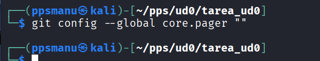

A continuación voy a crear la llave ssh para nuestro equipo para añadirla en github, y así darle un plus de seguridad en las conexiones:

```
ssh-keygen -t ed25519 -C $Tu_mail_github
```

```
ssh-keygen -t ed25519 -C $Tu_mail_github
```


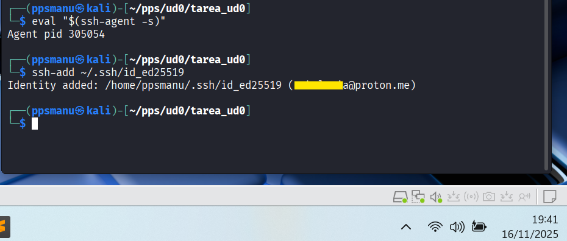

A continuación, procedo a copiar la clave ssh pública que he creado en github, y la borro en mi equipo,


y para copiarla en github, entro con la cuenta de github, y en mi perfil --> _settings_


y en _SSH and GPG keys_


Añado la clave a través del botón verde New SSS key,


le escribo un título, y añado:

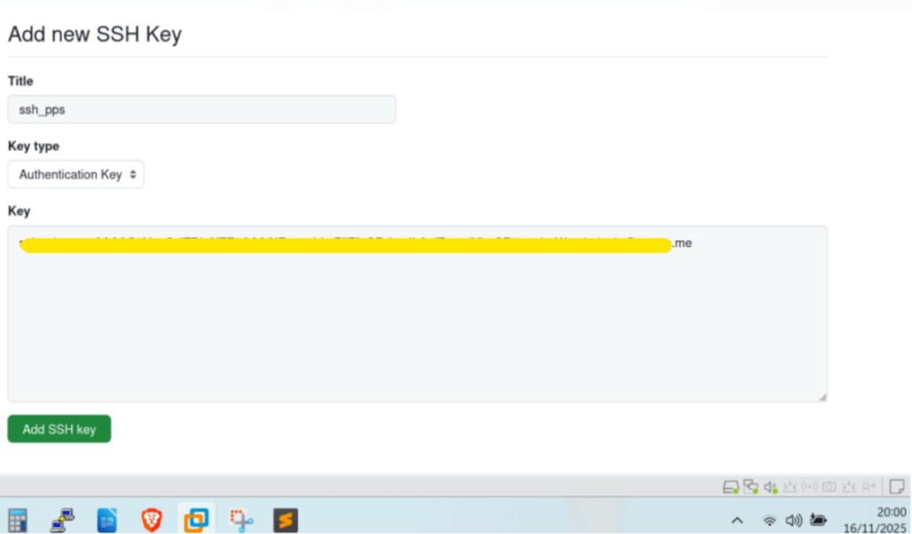

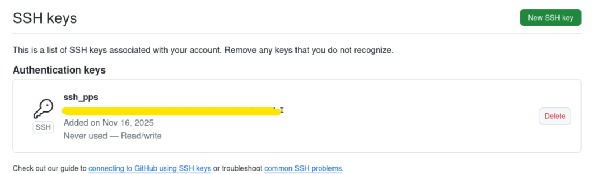

A continuación procedo a crear un repositorio en github,

haciendo clic en el avatar del perfil (arriba a la derecha con la flecha amarilla) y _Repositories_,


_New_,


Le doy nombre al repositorio, una descripción, y la opción de _Add README_ activada:

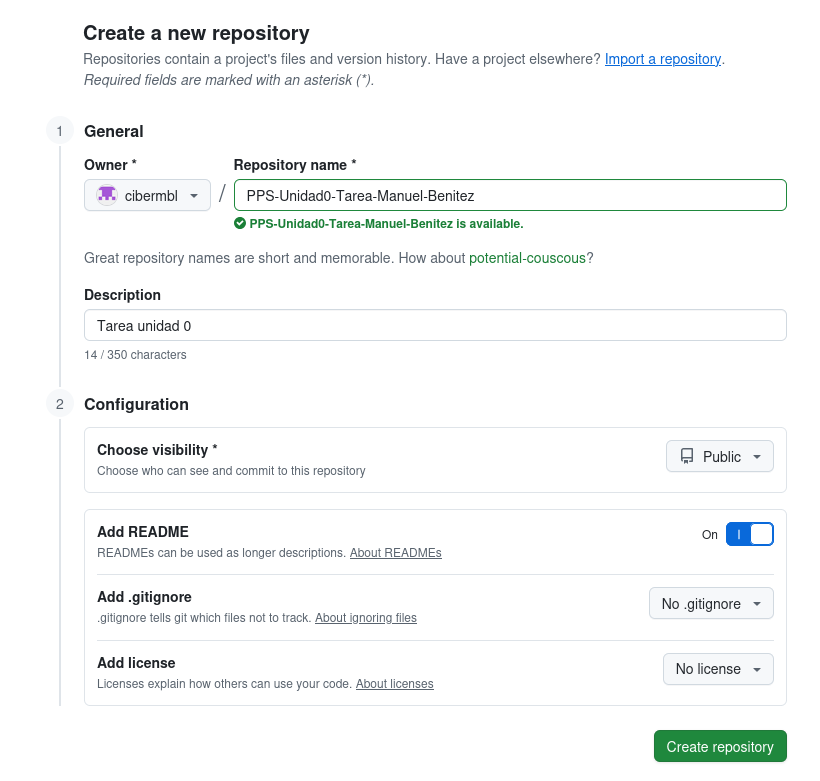

y a continuación copio el código de acceso en ssh,

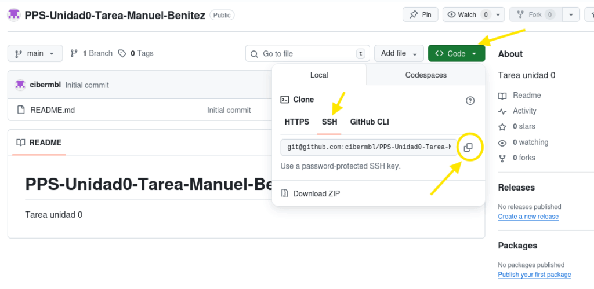

y hago un _git clone_ con ese código ssh del repositorio, tal que asi:

```
git clone git@github.com:cibermbl/PPS-Unidad0-Tarea-Manuel-Benitez.git
```

```
git clone git@github.com:cibermbl/PPS-Unidad0-Tarea-Manuel-Benitez.git
```

Observamos, que nos da una primera advertencia sobre la conexión al repositorio por ssh, y a la pregunta de si estoy seguro de que quiero conectarme escribo Yes,

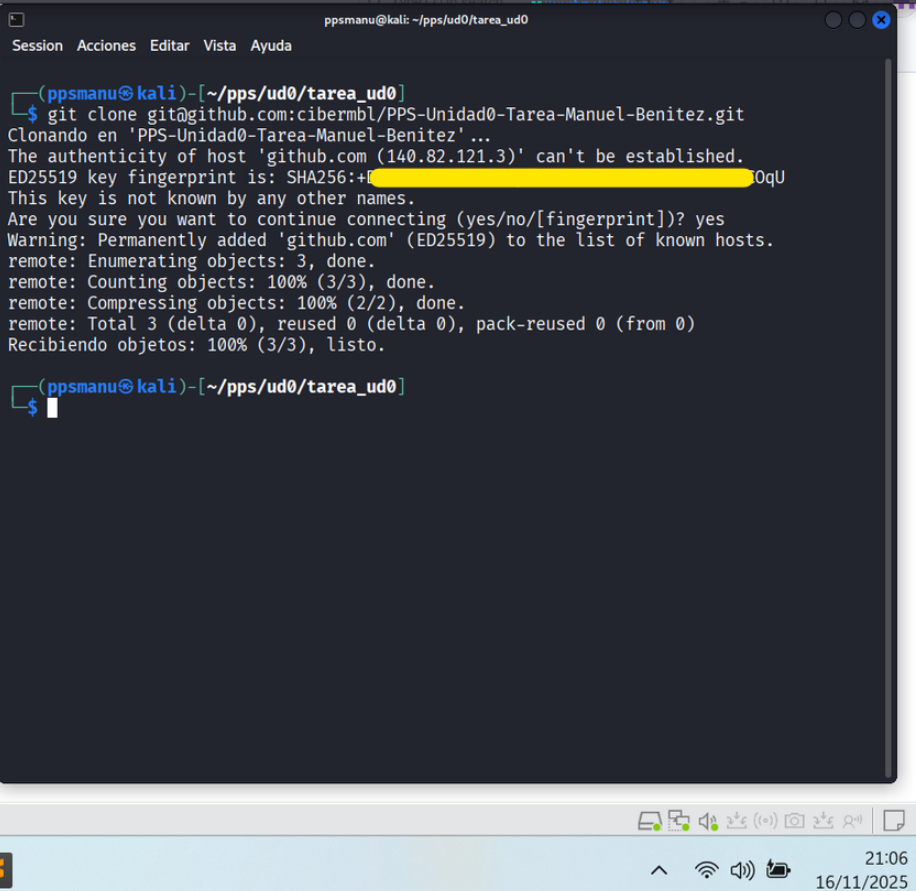

y observamos como ha creado el nuevo directorio --> _PPS-Unidad0-Tarea-Manuel-Benitez,_

navego dentro de él, y listo lo que contiene con -> _ls -la_

Observamos, como contiene el _README.md_, el directorio _.git,_ etc.


A continuación, procedo a crear la estructura del repositorio. Que debe ser como éste:


Para ello, en primer lugar procedo a instalar la herramienta GitHub CLI, la cual nos permite interactuar directamente desde la linea de comandos con GitHub, y nos permite crear, modificar, repositorios directamente desde la terminal.

Nota.-. En primer lugar, me cercioro de que ya tengo las variables inicializadas, tal y como lo hice en renglones anteriores, mediante el código:

```
git config user.name
```

```
git config user.name
```


Y efectivamente, tengo las variables declaradas, correctamente.

Instalación de GitHub CLI:

```
sudo apt update
sudo apt install gh
```

```
sudo apt update
sudo apt install gh
```


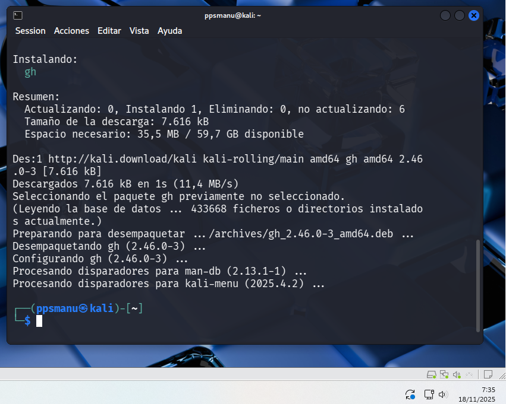

Una vez instalado, procedo a autenticarme en github.com:

```
gh auth login
```

```
gh auth login
```

Nos das dos opciones de autenticación, y escojo _GitHub.com_ (con el cursos y enter),


A continuación nos da dos opciones de protocolo de conexión, y dado que ya tengo configurado por ssh, para seguir la política de buenas prácticas en ciberseguridad, la escojo,

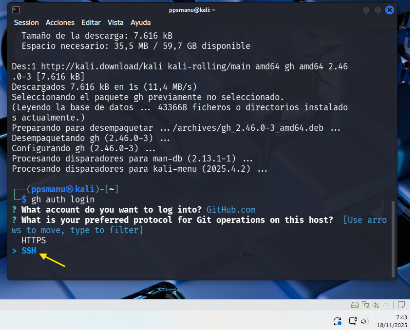

Observamos, como reconoce la clave pública, que anteriormente añadí en github, y le damos a enter,


A continuación procedo a logearme mediante la opción --> _Login with a web browser,_

Nos genera una clave de un solo uso, la cual deberemos de copiar en github.com,


Presiono Enter, y se abre el navegador, y procedemos a entrar con el usuario y contraseña de github, elegimos signed in as (con nuestro usuario de github), y clic en tecla _Continue,_

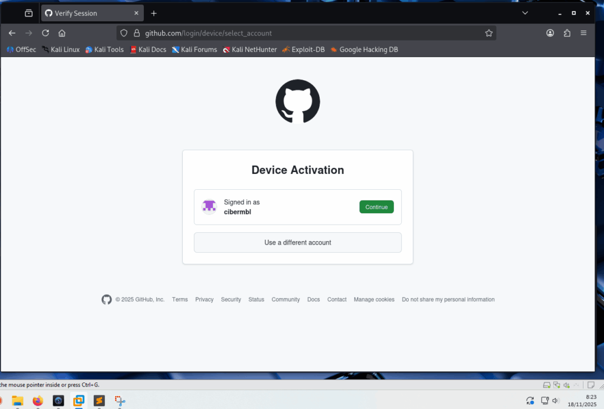

Y ya podemos pegar el código anterior:


Clic en _Authorize github_,


y ya comprobamos como ya está sincronizado con mi ordenador,


A continuación, paso a crear la estructura del repositorio:


Comandos:

```
#Para crear los directorios
<div></div>
mkdir calculator docs
<div></div>
#Para crear los archivos
<div></div>
touch directorio/archivo
<div></div>
#En el ejemplo:
<div></div>
touch calculator/__init__.py calculator/gui.py docs/index.md mkdocs.yml requiriments.txt
<div></div>
touch docs/git.m docs/gitActions.md docs/gitPages.md docs/docker.md docs/conclusiones.md
```

```
#Para crear los directorios

mkdir calculator docs

#Para crear los archivos

touch directorio/archivo

#En el ejemplo:

touch calculator/__init__.py calculator/gui.py docs/index.md mkdocs.yml requiriments.txt

touch docs/git.m docs/gitActions.md docs/gitPages.md docs/docker.md docs/conclusiones.md
```


Compruebo como está el estado del proyecto en Github:

```
git status
```

```
git status
```

y se puede comprobar como los archivos están los archivos sin seguimiento,

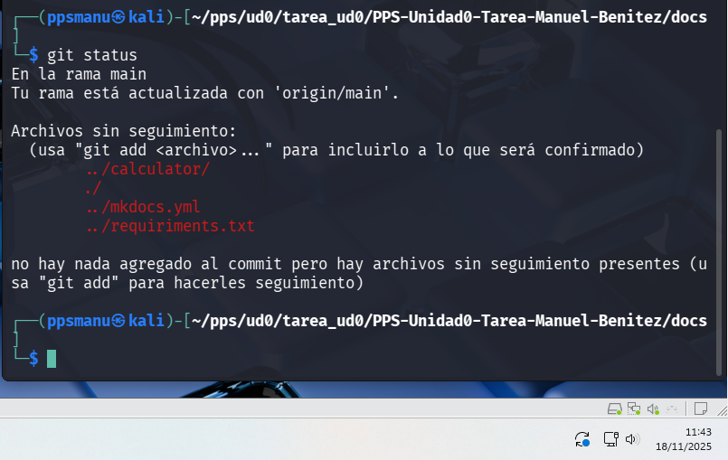

Añado todos los directorios y archivos al directorio github,

```
git add .
```

```
git add .
```

Compruebo el estado, y observamos como aparecen en el area _staged_ (en verde),


Muestro el contenido del directorio en forma de árbol,

```
tree -a
```

```
tree -a
```

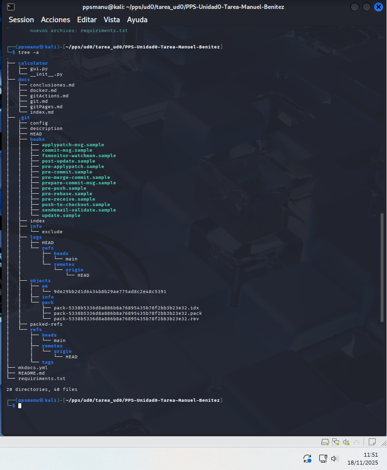

Procedo a borrar el directgorio .git,

```
rm -rf .git*
```

```
rm -rf .git*
```


Voy a actualizar el repositorio en remoto, para que no incluya el directorio .git

```
git init
git add.
git commit -m "Actualización de los archivos después de borrar .git"
git remote add origin git@github.com:cibermbl/PPS-Unidad0-Tarea-Manuel-Benitez.git
```

```
git init
git add.
git commit -m "Actualización de los archivos después de borrar .git"
git remote add origin git@github.com:cibermbl/PPS-Unidad0-Tarea-Manuel-Benitez.git
```

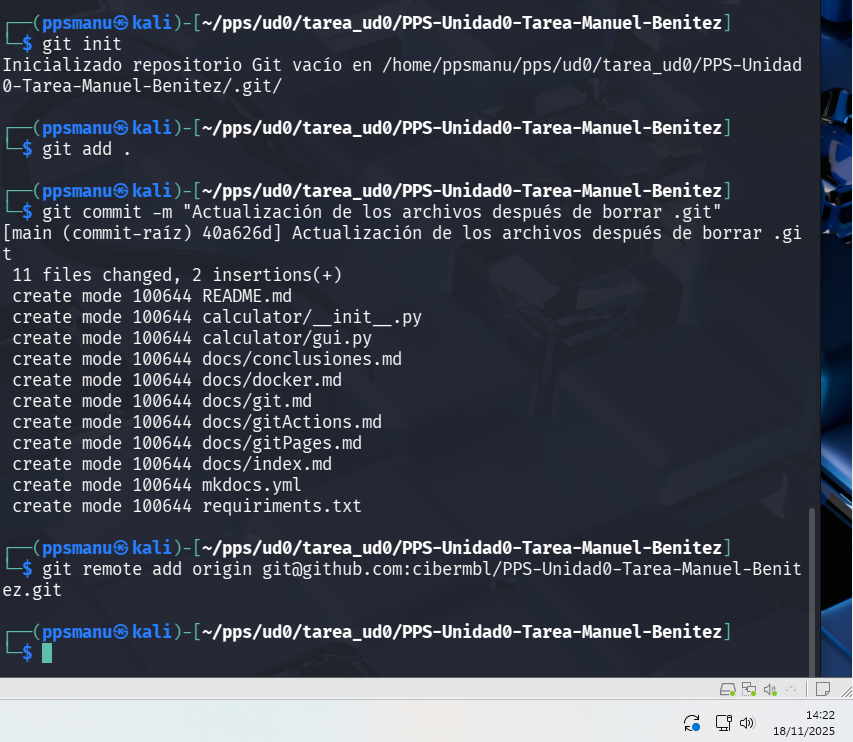

Voy a confirmar todos los cambios para la creación del repositorio, mediante los comandos,

y para subir los cambios,


Debido a la eliminación del escritorio .git, me da error por que hay commits que ya no están en el nuevo repositorio modificado,

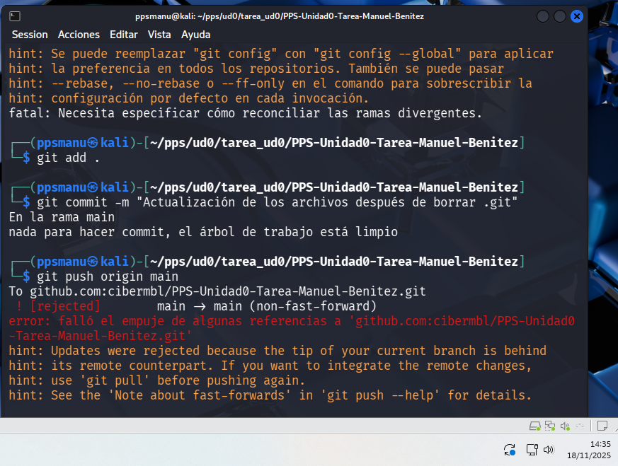

Para subsanar esto,

```
# forzamos el git push (eliminando los antiguos commits)
<div></div>
git push origin main -f
```

```
# forzamos el git push (eliminando los antiguos commits)

git push origin main -f
```


ya está todo subido en remoto a github,


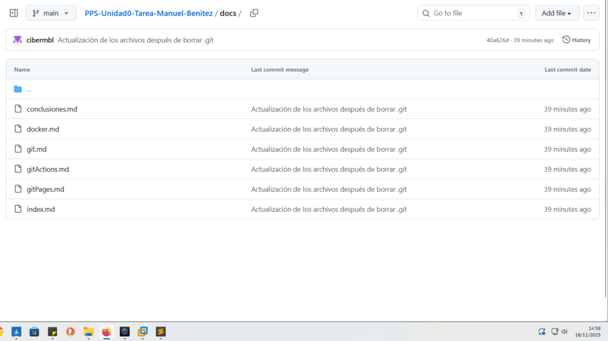

Por último, voy a crear dar contenido al archivo _mkdocs.yml,_ que es un archivo en lenguaje de marcas .yml, el cual sirve para crear toda la estructura de una página web estática html, a partir de los archivos .md que creamos en la estructura situados en la carpeta _docs/_,

├── docs/  
│ └── index.md  
│ └── git.md  
│ └── gitActions.md  
│ └── gitPages.md  
│ └── docker.md  
│ └── conclusiones.md  

Pues con:

```
nano mkdocs.yml
```

```
nano mkdocs.yml
```

Escribo lo siguiente:

```
# -------------------------------------------------------------
# CONFIGURACIÓN GENERAL DEL SITIO
# -------------------------------------------------------------
site_name: Documentación Unidad 0 - Tarea 
# Define el título que aparecerá en la barra de navegación y en la etiqueta <title> del navegador.
<div></div>
# -------------------------------------------------------------
# ESTRUCTURA DE NAVEGACIÓN (MENÚ)
# -------------------------------------------------------------
# Define la lista de enlaces y el orden de aparición en el menú de navegación principal.
nav:
  # El nombre de la sección en el menú: nombre_archivo.md
  - Home: index.md                 # Enlace a la página principal.
  - Git: git.md                    # Documentación del proceso de creación del repositorio Git.
  - GitHub Actions: gitActions.md  # Documentación del flujo de trabajo automatizado.
  - GitHub Pages: gitPages.md      # Documentación del despliegue en GitHub Pages.
  - Docker: docker.md              # Documentación de la configuración y despliegue con Docker y Nginx.
  - Conclusiones: conclusiones.md  # Reflexiones y conclusiones finales.
<div></div>
# -------------------------------------------------------------
# DIRECTORIOS
# -------------------------------------------------------------
# Ruta de la carpeta que contiene todos los archivos .md (Markdown) de la documentación.
# MkDocs buscará aquí los archivos listados en 'nav'.
doc_dir: docs
<div></div>
# -------------------------------------------------------------
# TEMA (Opcional, pero común)
# -------------------------------------------------------------
# theme:
#   name: 'material'   # Si se utiliza el tema Material for MkDocs.
#   # highlightjs: true
#   # code_fences: true

```

```
# -------------------------------------------------------------
# CONFIGURACIÓN GENERAL DEL SITIO
# -------------------------------------------------------------
site_name: Documentación Unidad 0 - Tarea 
# Define el título que aparecerá en la barra de navegación y en la etiqueta <title> del navegador.

# -------------------------------------------------------------
# ESTRUCTURA DE NAVEGACIÓN (MENÚ)
# -------------------------------------------------------------
# Define la lista de enlaces y el orden de aparición en el menú de navegación principal.
nav:
  # El nombre de la sección en el menú: nombre_archivo.md
  - Home: index.md                 # Enlace a la página principal.
  - Git: git.md                    # Documentación del proceso de creación del repositorio Git.
  - GitHub Actions: gitActions.md  # Documentación del flujo de trabajo automatizado.
  - GitHub Pages: gitPages.md      # Documentación del despliegue en GitHub Pages.
  - Docker: docker.md              # Documentación de la configuración y despliegue con Docker y Nginx.
  - Conclusiones: conclusiones.md  # Reflexiones y conclusiones finales.

# -------------------------------------------------------------
# DIRECTORIOS
# -------------------------------------------------------------
# Ruta de la carpeta que contiene todos los archivos .md (Markdown) de la documentación.
# MkDocs buscará aquí los archivos listados en 'nav'.
doc_dir: docs

# -------------------------------------------------------------
# TEMA (Opcional, pero común)
# -------------------------------------------------------------
# theme:
#   name: 'material'   # Si se utiliza el tema Material for MkDocs.
#   # highlightjs: true
#   # code_fences: true
```

Como se observa en el el mkdocs.yml, en nav, partir de las .md que están en /docs, crea un menú de navegación. En doc\_dir: se define la ruta donde están los .md


```
# Guardo el archivo
Ctrl + o
```

```
# Guardo el archivo
Ctrl + o
```


