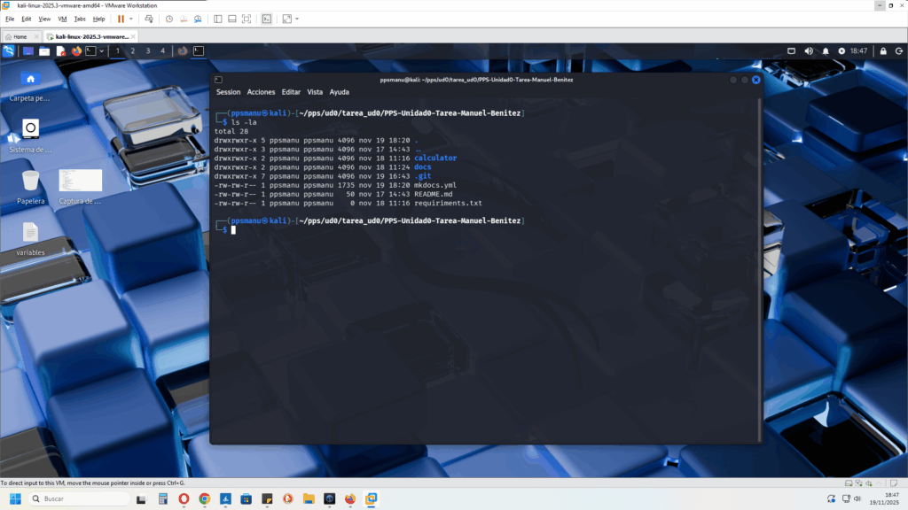
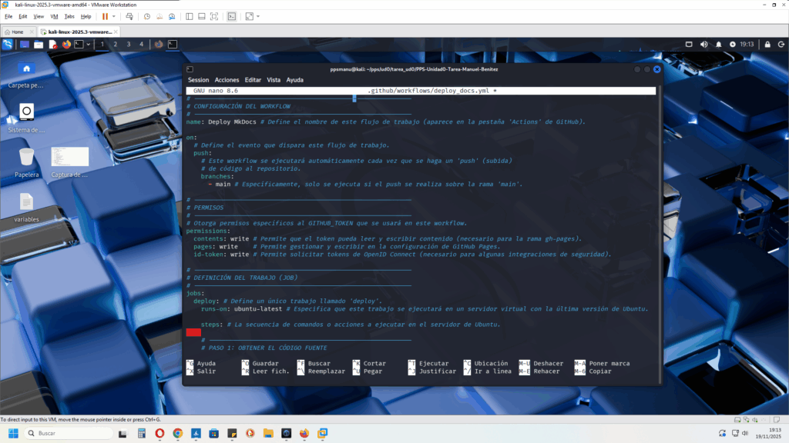

## 2\. Creación de WorkFlow de GitHub Actions

En primer lugar mkdocs es una extensión de python, la cual ejecutaremos en el terminal mediante el workflow que vamos a crear, ejecutará mediante _git push_, instrucciones determinadas.

Dicho workflow debe ir dentro de un directorio llamado _.github_, vamos a comprobar mediante:

```
ls -la
```

```
ls -la
```

y vemos que dicho directorio no está en la estructura,



y vemos que no existe, por lo tanto, procedo a crearlo:

```
mkdir -p .github/workflows
```

```
mkdir -p .github/workflows
```


Y para definir el flujo de trabajo, creo el siguiente archivo,

```
.github/workflows/deploy_docs.yml
```

```
.github/workflows/deploy_docs.yml
```

y con el siguiente código:

```
# -----------------------------------------------------------
# CONFIGURACIÓN DEL WORKFLOW
# -----------------------------------------------------------
name: Deploy MkDocs # Define el nombre de este flujo de trabajo (aparece en la pestaña 'Actions' de GitHub).
<div></div>
on:
  # Define el evento que dispara este flujo de trabajo.
  push:
    # Este workflow se ejecutará automáticamente cada vez que se haga un 'push' (subida)
    # de código al repositorio.
    branches:
      - main # Específicamente, solo se ejecuta si el push se realiza sobre la rama 'main'.
<div></div>
# -----------------------------------------------------------
# PERMISOS
# -----------------------------------------------------------
# Otorga permisos específicos al GITHUB_TOKEN que se usará en este workflow.
permissions:
  contents: write # Permite que el token pueda leer y escribir contenido (necesario para la rama gh-pages).
  pages: write    # Permite gestionar y escribir en la configuración de GitHub Pages.
  id-token: write # Permite solicitar tokens de OpenID Connect (necesario para algunas integraciones de seguridad).
<div></div>
# -----------------------------------------------------------
# DEFINICIÓN DEL TRABAJO (JOB)
# -----------------------------------------------------------
jobs:
  deploy: # Define un único trabajo llamado 'deploy'.
    runs-on: ubuntu-latest # Especifica que este trabajo se ejecutará en un servidor virtual con la última versión de Ubuntu.
<div></div>
    steps: # La secuencia de comandos o acciones a ejecutar en el servidor de Ubuntu.
    
    # -------------------------------------------------------
    # PASO 1: OBTENER EL CÓDIGO FUENTE
    # -------------------------------------------------------
    - name: Checkout Repo # Nombre descriptivo del paso.
      # Utiliza una acción oficial de GitHub para clonar el repositorio
      # completo en el entorno de trabajo del Runner.
      uses: actions/checkout@v3
<div></div>
    # -------------------------------------------------------
    # PASO 2: CONFIGURAR PYTHON
    # -------------------------------------------------------
    - name: Set up Python # Nombre descriptivo del paso.
      # Utiliza una acción oficial para configurar el entorno de Python.
      uses: actions/setup-python@v4
      with:
        python-version: '3.x' # Especifica que se debe usar la última versión de Python 3.
<div></div>
    # -------------------------------------------------------
    # PASO 3: INSTALAR DEPENDENCIAS
    # -------------------------------------------------------
    - name: Install dependencies # Nombre descriptivo del paso.
      # Comando que se ejecuta en la terminal de Ubuntu.
      # Instala el generador de documentación MkDocs (necesario para el siguiente paso).
      run: pip install mkdocs
<div></div>
    # -------------------------------------------------------
    # PASO 4: CONSTRUIR Y DESPLEGAR LA DOCUMENTACIÓN
    # -------------------------------------------------------
    - name: Deploy docs # Nombre descriptivo del paso.
      # Comando que se ejecuta en la terminal.
      # 1. 'mkdocs gh-deploy': Construye la documentación (generando los archivos HTML/CSS/JS).
      # 2. '--force': Sube esos archivos generados y fuerza su publicación en la rama 'gh-pages'.
      run: mkdocs gh-deploy --force
      # Configuración de variables de entorno específicas para este paso.
      env:
        # Pasa el Token de GitHub. MkDocs lo necesita para autenticarse y subir
        # los archivos a la rama 'gh-pages' del repositorio.
        GH_TOKEN: ${{ secrets.GITHUB_TOKEN }}
```

```
# -----------------------------------------------------------
# CONFIGURACIÓN DEL WORKFLOW
# -----------------------------------------------------------
name: Deploy MkDocs # Define el nombre de este flujo de trabajo (aparece en la pestaña 'Actions' de GitHub).

on:
  # Define el evento que dispara este flujo de trabajo.
  push:
    # Este workflow se ejecutará automáticamente cada vez que se haga un 'push' (subida)
    # de código al repositorio.
    branches:
      - main # Específicamente, solo se ejecuta si el push se realiza sobre la rama 'main'.

# -----------------------------------------------------------
# PERMISOS
# -----------------------------------------------------------
# Otorga permisos específicos al GITHUB_TOKEN que se usará en este workflow.
permissions:
  contents: write # Permite que el token pueda leer y escribir contenido (necesario para la rama gh-pages).
  pages: write    # Permite gestionar y escribir en la configuración de GitHub Pages.
  id-token: write # Permite solicitar tokens de OpenID Connect (necesario para algunas integraciones de seguridad).

# -----------------------------------------------------------
# DEFINICIÓN DEL TRABAJO (JOB)
# -----------------------------------------------------------
jobs:
  deploy: # Define un único trabajo llamado 'deploy'.
    runs-on: ubuntu-latest # Especifica que este trabajo se ejecutará en un servidor virtual con la última versión de Ubuntu.

    steps: # La secuencia de comandos o acciones a ejecutar en el servidor de Ubuntu.
    
    # -------------------------------------------------------
    # PASO 1: OBTENER EL CÓDIGO FUENTE
    # -------------------------------------------------------
    - name: Checkout Repo # Nombre descriptivo del paso.
      # Utiliza una acción oficial de GitHub para clonar el repositorio
      # completo en el entorno de trabajo del Runner.
      uses: actions/checkout@v3

    # -------------------------------------------------------
    # PASO 2: CONFIGURAR PYTHON
    # -------------------------------------------------------
    - name: Set up Python # Nombre descriptivo del paso.
      # Utiliza una acción oficial para configurar el entorno de Python.
      uses: actions/setup-python@v4
      with:
        python-version: '3.x' # Especifica que se debe usar la última versión de Python 3.

    # -------------------------------------------------------
    # PASO 3: INSTALAR DEPENDENCIAS
    # -------------------------------------------------------
    - name: Install dependencies # Nombre descriptivo del paso.
      # Comando que se ejecuta en la terminal de Ubuntu.
      # Instala el generador de documentación MkDocs (necesario para el siguiente paso).
      run: pip install mkdocs

    # -------------------------------------------------------
    # PASO 4: CONSTRUIR Y DESPLEGAR LA DOCUMENTACIÓN
    # -------------------------------------------------------
    - name: Deploy docs # Nombre descriptivo del paso.
      # Comando que se ejecuta en la terminal.
      # 1. 'mkdocs gh-deploy': Construye la documentación (generando los archivos HTML/CSS/JS).
      # 2. '--force': Sube esos archivos generados y fuerza su publicación en la rama 'gh-pages'.
      run: mkdocs gh-deploy --force
      # Configuración de variables de entorno específicas para este paso.
      env:
        # Pasa el Token de GitHub. MkDocs lo necesita para autenticarse y subir
        # los archivos a la rama 'gh-pages' del repositorio.
        GH_TOKEN: ${{ secrets.GITHUB_TOKEN }}
```



Para entender el _deploy\_doc_s.yml:

Este archivo hace funcionar un workflow de Github Actions, y se consigue crear una serie de tareas automáticas que Github las ejecutará automáticamente.

En este caso concreto genera y además publica la documentación creadas por MkDocs, cada vez que subimos un cambio al repositorio.

```
on:
  push:
    branches:
      - main

```

```
on:
  push:
    branches:
      - main
```

Cada vez que ejecutamos un push en git, el workflow lo ejecuta automáticamente, y en concreto en la rama main.

```
permissions:
  contents: write
  pages: write
  id-token: write

```

```
permissions:
  contents: write
  pages: write
  id-token: write
```

Solo permisos de escritura, para escribir en el repositorio remoto, en Github pages donde se publicará la documentación.

En _jobs:_ se definen cuatro pasos,

```
uses: actions/checkout@v3
```

```
uses: actions/checkout@v3
```

Descarga todo el código del repositorio para poder trabajar con él.

```
uses: actions/setup-python@v4
with:
  python-version: '3.x'

```

```
uses: actions/setup-python@v4
with:
  python-version: '3.x'
```

MKDocs está hecho en Python, y para ello se define la versión que permite ejecutarlo, en este caso la 3.

```
run: pip install mkdocs
```

```
run: pip install mkdocs
```

Se instala el programa que generará la documentación en formato web (HTML).

```
run: mkdocs gh-deploy --force
env:
  GH_TOKEN: ${{ secrets.GITHUB_TOKEN }}
```

```
run: mkdocs gh-deploy --force
env:
  GH_TOKEN: ${{ secrets.GITHUB_TOKEN }}
```

MkDocs genera la web a partir de los archivos .md de la carpeta /docs, los publica automáticamente en la rama gh-pages, y Github Pages lo utiliza para mostrar la documentación online. El token, permite que MkDocs, tenga los permisos necesarios para subir esos cambios al repositorio.

A continuación voy a subir todos los cambios a remoto, mediante _commit_ y _push_,

  ```
  git add .
  git commit -m "Configuración de MkDocs y pipeline de documentación"
  git push origin main
```

```
  git add .
  git commit -m "Configuración de MkDocs y pipeline de documentación"
  git push origin main
```


A continuación, procedo a comprobar en Github, que se han generado los cambios, y en la pestaña Actions, compruebo como se puede ver el workflow recien creado:

En primer lugar, se puede observar como se ha creado correctamente, el directorio _.github/workflows_ con el archivo [_deploy\_docs.yml_](https://github.com/cibermbl/PPS-Unidad0-Tarea-Manuel-Benitez/blob/main/.github/workflows/deploy_docs.yml) en su interior,


y en la pestaña Actions, podemos ver como el workflow está ejecutandose:


Reviso el log,


