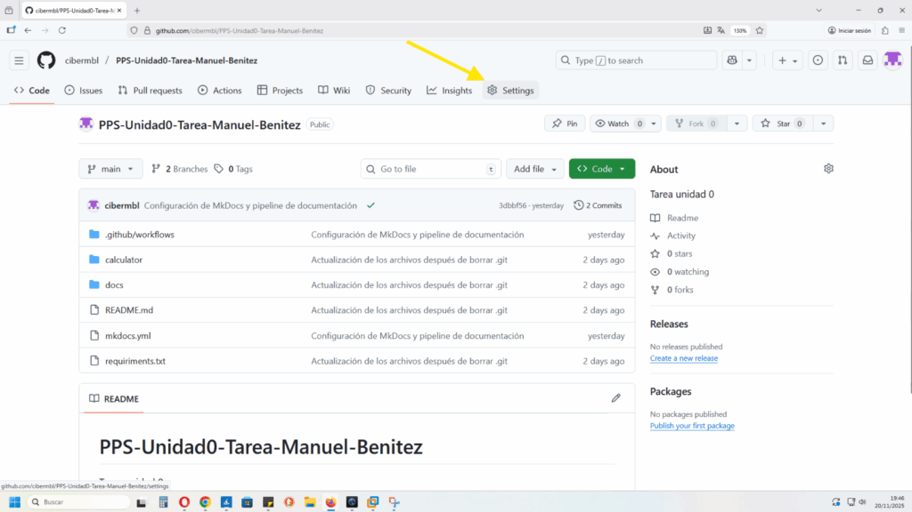
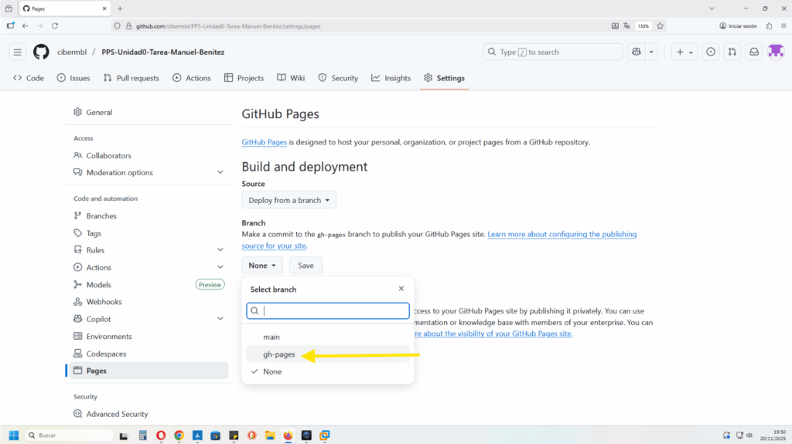

## **3\. Vinculación con GitHub Pages**

Una vez comprobado que nuestro workflow está en marcha, y ha completado una pipeline, hacemos estos pasos para activar Github Pages:

Settings / Pages,

Pages,

Y seleccionamos el branch --> gh-pages

Dejamos el directorio /(root) que viene por defecto y clic en save, para guardar los cambios,

Con esto ya hemos configurado la fuente del despliegue, a la rama gh-pages.

Observamos, como ya se ha generado el dominio de gh-pages --> `cibermbl.github.io`

Para ver si carga la pagina hemos de añadirle al dominio el repositorio de Github, que en este caso es ->

_**[cibermbl.github.io/PPS-Unidad0-Tarea-Manuel-Benitez](http://cibermbl.github.io/PPS-Unidad0-Tarea-Manuel-Benitez)**_

Y efectivamente vemos como la carga, correctamente:

Ahora está todas las páginas vacias. Ya podemos empezar a darle contenido a cada una de las páginas, que están en el directorio /docs, en leguaje markdown.

